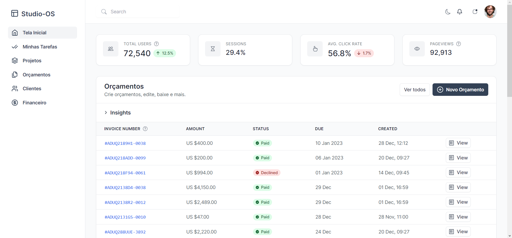

# studio-client

[PT-BR]
Studio-OS é um projeto criado por mim com o objetivo de ser um gerenciador de tarefas, projetos e orçamentos para um pequeno negócio que possuo na área do Design Gráfico.
Iniciei o projeto há alguns dias atrás e estarei atualizando ele periodicamente na intenção de compor meu portfólio.

Este repositório é uma parte do projeto, destinada ao cliente do sistema. Será usado React.js em sua construção.

[EN]
Studio-OS is a project made by me with the purpose to be a task, projects and invoices manager to my small business in graphic design.
I started this project a few days ago and it will be updated periodicaly with the intention of be a project to my portfolio.

This repository is a part of the project, the client-side part. I'll be using React.js to build the frontend.

## Changelog
#### 2023-05-26
- Instalação inicial do Vite para React.js
- Instalação do Lucide Icons
- Instalação do TailwindCSS
- Instalação do Preline UI
- UI Base do Dashboard